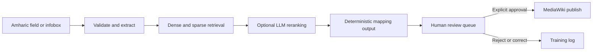

# agentic-amdbpedia

An AI-assisted workflow for mapping Amharic Wikipedia infobox fields to the
English DBpedia ontology.

The project combines hybrid retrieval, MCP tools, a review queue, and a SvelteKit
interface. It proposes ontology mappings, generates deterministic MediaWiki
syntax, and keeps publication behind an explicit human approval step.

## Domain

This project supports **cross-lingual semantic web engineering** between
**Amharic Wikipedia** and the **English DBpedia ontology**. It helps editors find
schema-specific properties such as `length`, `openingDate`, and IATA or ICAO
identifiers without relying on literal translation alone.

Retrieval-augmented generation is required because ontology properties are
specialized and must be grounded in the real DBpedia schema.
**MCP tools are required** to expose that retrieval safely and to generate
deterministic mapping syntax instead of letting a language model invent XML.

## What it provides

- Hybrid dense and sparse search across roughly 2,948 DBpedia properties
- Amharic aliases enriched from published DBpedia mappings
- A four-step infobox pipeline: extract, predict, format, and queue for review
- A SvelteKit interface for mapping suggestions, review decisions, and coverage
- MCP tools for semantic matching and deterministic XML generation
- Optional, consent-gated publication to `mappings.dbpedia.org`
- Evaluation, integration, end-to-end, and performance test suites

## Architecture



Retrieval runs locally and merges semantic and lexical rankings using reciprocal
rank fusion. The LLM may rerank retrieved candidates, but it cannot introduce a
property outside that candidate set. Low-confidence input returns an explicit
no-match result.

The HTTP API streams pipeline progress over server-sent events. SQLite is used
by default; PostgreSQL is available through Docker Compose. Publishing is
disabled unless MediaWiki bot credentials and explicit consent are provided.

## Quick start

### Prerequisites

- Python 3.11
- [uv](https://docs.astral.sh/uv/)
- Node.js and pnpm
- Docker, only if you want PostgreSQL
- A Groq API key for agent-assisted features

### 1. Configure the project

```bash
cp .env.example .env
```

Add your `GROQ_API_KEY` to `.env`. To use local SQLite, remove or leave
`DATABASE_URL` unset. To use PostgreSQL, keep the example value and start it:

```bash
docker compose up -d postgres
```

### 2. Start the API

```bash
uv sync --frozen --python 3.11
just run-http
```

The API starts at `http://localhost:8001`. If that port is occupied, the runner
selects the next available port and prints it.

The first startup downloads the embedding models and builds the local ontology
index. Later starts reuse the cache in `data/.cache/`.

### 3. Start the frontend

In another terminal:

```bash
cd frontend
pnpm install
pnpm run dev --open
```

The frontend expects the API at `http://localhost:8001`. Set
`PUBLIC_CROSS_LINGUAL_URL` in `frontend/.env` if the API uses another port.

## Using the application

- Paste an Amharic infobox into the Mapping Assistant to run the full pipeline.
- Enter a single Amharic property name to search the ontology directly.
- Open `/review` to approve, reject, or correct queued suggestions.
- Open `/coverage` to see reviewed and published template coverage.

Publishing is never automatic. A review decision must include explicit publish
consent, and `.env` must contain a MediaWiki bot username and bot password.
Never use your normal MediaWiki account password.

Worked inputs and expected responses are available in
[`examples/demo.md`](examples/demo.md).

## MCP server

Start the MCP server with:

```bash
just run-server
```

Generate a credential-free Claude Desktop configuration block with:

```bash
uv run python scripts/print_desktop_config.py
```

The server exposes:

- `find_semantic_match`
- `generate_mapping_syntax`
- `resources://benchmarks/latest`

Keep credentials in the ignored project `.env`, not in the desktop client
configuration.

## Common commands

```bash
just test              # Fast unit tests
just lint              # Ruff, formatting, and strict mypy
just test-integration  # Real-model integration tests
just test-e2e          # Full pipeline tests
just test-perf         # Latency checks
just validate-corpus   # Validate ontology documents
```

Integration and end-to-end tests download real embedding models on their first
run and therefore require network access.

## Documentation

- [`implementation.md`](implementation.md) — roadmap and implementation detail
- [`examples/demo.md`](examples/demo.md) — complete demo transcripts
- [`frontend/README.md`](frontend/README.md) — frontend routes and API contracts
- [`corpus-refresh.md`](corpus-refresh.md) — refreshing ontology and mapping data
- [`evaluation/results.md`](evaluation/results.md) — retrieval evaluation results
- [`CHANGELOG.md`](CHANGELOG.md) — notable project changes

## Requirements Traceability

The automated suite links the main system boundaries to executable evidence.
Representative checks include:

| Capability | Verification |
|---|---|
| Hybrid ontology retrieval | `tests/test_retrieval.py::test_search_finds_exact_alias_match_via_sparse_channel` |
| MCP semantic search | `tests/test_mcp_server.py::test_find_semantic_match_happy_path` |
| End-to-end pipeline | `tests/test_pipeline_orchestration.py::test_full_pipeline_end_to_end_produces_a_pending_review_row_with_length_predicted` |
| Consent-gated publishing | `tests/test_publish.py::test_publish_is_refused_without_consent` |
| Prompt-injection guardrail | `tests/test_agent.py::test_injection_classifier_catches_known_patterns` |

Run `just test`, `just test-integration`, and `just test-e2e` for the complete
verification suite.

## Future Work

- Expand the Amharic alias corpus and evaluation set.
- Add authentication and authorization to the reviewer-facing HTTP application.
- Automate post-publication DBpedia extraction and verification.
- Fine-tune the reranker from accepted, corrected, and rejected review data.
- Package the services for production deployment.
